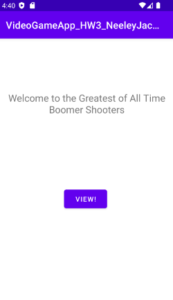
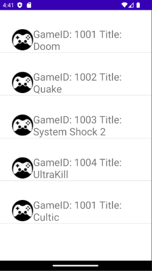
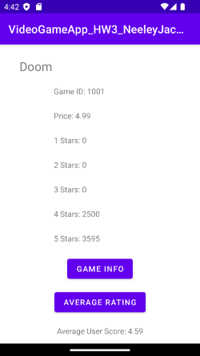

# videogamelistapp
- Simple android app that uses listviews to display different class objects.
- GET request is made to a firebase real time database, PUT requests are made to update prices in the database.
- This repo contains Java and XML files only.

## Code
- [game classes](https://github.com/jacneeley/REST-videogamelistapp/blob/main/app/src/main/java/edu/txstate/jcn73/videogameapp_hw3_neeleyjacob/Games.java)
- [game activity screen](https://github.com/jacneeley/REST-videogamelistapp/blob/main/app/src/main/java/edu/txstate/jcn73/videogameapp_hw3_neeleyjacob/GamesActivity.java)
- [main activity screen](https://github.com/jacneeley/REST-videogamelistapp/blob/main/app/src/main/java/edu/txstate/jcn73/videogameapp_hw3_neeleyjacob/MainActivity.java)
- [selected game activity screen](https://github.com/jacneeley/REST-videogamelistapp/blob/main/app/src/main/java/edu/txstate/jcn73/videogameapp_hw3_neeleyjacob/SelectedGame.java)

## Screens
  
